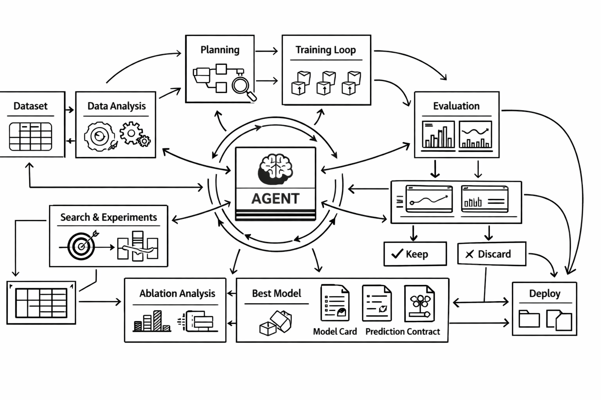

<h1 align="center">automodelling</h1>

<p align="center"><em>An agentic tabular modelling system designed to be used for ML/DL standard training pipeline</em></p>

<p align="center">
  
</p>

You give it a tabular dataset, it runs structured experiments, tracks metrics, keeps the best artifact, and writes the reports needed to understand what changed and what to deploy.

It is strongest on tabular data. It is not yet a general image, text, audio, or video training framework.

## Running The Agent

If you want to use this in the `karpathy/autoresearch` style, the intended flow is:

1. open the repo in your coding agent
2. tell the agent to read [program.md](/Users/hrishikesh/Desktop/automodelling/program.md)
3. let the agent iterate mostly by editing [train.py](/Users/hrishikesh/Desktop/automodelling/train.py), while keeping [prepare.py](/Users/hrishikesh/Desktop/automodelling/prepare.py) stable
4. run the repo-level agent entrypoint:

```bash
python agent.py --dataset /path/to/data.csv --target target_column --output runs/my_task
```

For a coding agent prompt, this is the simplest version:

```text
Read program.md, keep prepare.py stable, improve train.py, run experiments, track the metrics, and keep only real improvements.
```

## What You Can Do

- run a full agentic search from a dataset path or URL
- compare classical ML and tabular deep learning in one workflow
- inspect metrics, plots, model artifacts, and reasoning after each run
- generate deploy-facing handoff files such as a model card and prediction contract
- run ablation analysis to see whether a gain came from one isolated change or from a bundle of changes
- optionally let an external LLM choose the next experiment

## Quick Start

### 1. Install

```bash
python3 -m venv .venv
source .venv/bin/activate
pip install -r requirements.txt
```

### 2. Run the agentic search

Recommended `autoresearch`-style wrapper:

```bash
python agent.py --dataset /path/to/data.csv --target churn --output runs/churn_search
```

Direct backend entrypoint:

```bash
python automodelling.py --dataset /path/to/data.csv --target churn --output runs/churn_search
```

Equivalent explicit alias:

```bash
python automodelling.py agent --dataset /path/to/data.csv --target churn --output runs/churn_search
```

If you do not pass `--goal`, the tool will generate a sensible default goal from the target.

The `dataset` value can be:

- a local file path
- a direct URL
- a `file://...` URL

### 3. Inspect the result

Human-friendly:

```bash
python automodelling.py inspect --output runs/churn_search
```

Machine-readable:

```bash
python automodelling.py inspect --output runs/churn_search --json
```

## Agent Entry Point

If you are asking, "what command does the agent actually run?", the most `autoresearch`-style answer is this:

```bash
python agent.py --dataset /path/to/data.csv --target target_column --output runs/my_task
```

The direct backend form is:

```bash
python automodelling.py agent --dataset /path/to/data.csv --target target_column --output runs/my_task
```

The default form without the word `agent` does the same search:

```bash
python automodelling.py --dataset /path/to/data.csv --target target_column --output runs/my_task
```

For an external agent or orchestration system, the normal usage pattern is:

1. Start the search:

```bash
python agent.py --dataset /path/to/data.csv --target target_column --output runs/my_task --max-experiments 5
```

1. Read back the state:

```bash
python automodelling.py inspect --output runs/my_task --json
```

1. Use the returned machine-readable artifacts:

- `latest_summary.json` for the newest detailed result
- `best_summary.json` for the promoted best artifact
- `agentic_manifest.json` for the top-level run state
- `analysis/ablation_summary.md` for attribution across experiments
- `handoff/prediction_contract.json` for deployment-facing output details

The agent does not need to scrape markdown if it uses `inspect --json`.

## The Easiest Mental Model

Think of the project as 3 layers:

- [prepare.py](/Users/hrishikesh/Desktop/automodelling/prepare.py): fixed evaluation harness
- [train.py](/Users/hrishikesh/Desktop/automodelling/train.py): candidate models and training logic
- [agent.py](/Users/hrishikesh/Desktop/automodelling/agent.py): the repo-level agent entrypoint
- [automodelling.py](/Users/hrishikesh/Desktop/automodelling/automodelling.py): the backend agent/search runner

There is also [planning.py](/Users/hrishikesh/Desktop/automodelling/planning.py), which decides what to try next, and can optionally use an external LLM planner.

## What Happens In One Run

When you run `automodelling.py`, the system:

1. loads the dataset and resolves the target
2. infers classification or regression if needed
3. creates a fixed train/validation split and CV setup
4. builds preprocessing for numeric and categorical features
5. runs safety checks such as duplicate detection, leakage hints, and split drift
6. evaluates candidate models
7. compares the result against the previous best
8. keeps or discards the run for promotion
9. writes reports, plots, artifacts, and ablation analysis

## Main Workflows

### Agentic search

This is the default and recommended workflow.

```bash
python agent.py --dataset /path/to/data.csv --target target_column --output runs/my_task
```

Equivalent backend forms:

```bash
python automodelling.py --dataset /path/to/data.csv --target target_column --output runs/my_task
python automodelling.py agent --dataset /path/to/data.csv --target target_column --output runs/my_task
```

Useful flags:

- `--max-experiments 5` to limit the search length
- `--goal "Predict customer churn"` to make the objective explicit
- `--disable-deep-learning` to force classical ML only

### Single experiment

Use this when you want to run exactly one experiment instead of a search.

```bash
python agent.py run --program program.json --output runs/my_task_single --description "baseline sweep"
```

You can also call [train.py](/Users/hrishikesh/Desktop/automodelling/train.py) directly:

```bash
python train.py --program program.json --output runs/my_task_single --description "baseline sweep"
```

### Starter config file

You can generate a starter JSON program file:

```bash
python agent.py init-program --path program.json --dataset /path/to/data.csv --target churn --goal "Predict churn"
```

## Program JSON

You do not need a `program.json` to get started, but it is useful when you want a repeatable setup.

Example:

```json
{
  "goal": "Predict customer churn for telecom users",
  "dataset": "/absolute/path/to/customers.csv",
  "target": "churn",
  "test_size": 0.2,
  "cv_folds": 5,
  "random_state": 42,
  "drop_high_missing_threshold": 0.98,
  "categorical_min_frequency": 0.01,
  "categorical_max_categories": 50,
  "numeric_clip_quantile": 0.01,
  "binary_threshold_metric": "balanced_accuracy",
  "enable_deep_learning": true,
  "deep_learning_hidden_dims": [256, 128],
  "deep_learning_dropout": 0.1,
  "deep_learning_learning_rate": 0.001,
  "deep_learning_weight_decay": 0.0001,
  "deep_learning_batch_size": 256,
  "deep_learning_max_epochs": 30,
  "deep_learning_patience": 6,
  "deep_learning_validation_fraction": 0.15,
  "deep_learning_device": "auto"
}
```

The most useful config fields are:

- `target`: explicit target column
- `test_size`: validation split size
- `cv_folds`: cross-validation folds
- `enable_deep_learning`: include tabular PyTorch models
- `binary_threshold_metric`: objective used to tune the binary decision threshold
- `candidate_profile`: manually steer the search family if you do not want automatic ordering

## Models Included

Classification candidates:

- logistic regression
- random forest
- extra trees
- histogram gradient boosting
- soft-voting ensemble
- torch tabular MLP when deep learning is enabled and `torch` is available

Regression candidates:

- ridge
- elastic net
- huber regression
- random forest
- extra trees
- histogram gradient boosting
- voting ensemble
- torch tabular MLP when deep learning is enabled and `torch` is available

## Metrics

Primary metrics:

- binary classification: `roc_auc`
- multiclass classification: `f1_weighted`
- regression: `r2`

Secondary metrics:

- classification: `accuracy`, `balanced_accuracy`, `f1_weighted`, `precision_positive`, `recall_positive`, `roc_auc`, `log_loss`, `brier_score`
- regression: `r2`, `mae`, `rmse`, `median_ae`

## Safety And Reliability Checks

Before you trust a score, the harness also checks for:

- constant columns
- mostly missing columns
- rare and high-cardinality categorical behavior
- identifier-like columns
- duplicate feature rows
- conflicting duplicate targets
- possible target leakage columns
- train/validation target drift

## What Gets Written

Each run directory contains a full artifact trail.

Core run outputs:

- `results.tsv`: experiment registry
- `latest_summary.json`: latest full summary
- `best_summary.json`: promoted best summary
- `best_model.joblib`: promoted model artifact when a run is kept

Per-experiment outputs:

- `experiments/exp_XXXX.json`: detailed experiment summary
- `experiments/exp_XXXX_agent_report.md`: readable report for that experiment
- `experiments/exp_XXXX_validation_predictions.csv`: validation predictions for the winning candidate

Visual outputs:

- `plots/improvement_history.png`
- `plots/exp_XXXX_candidate_scores.png`
- `plots/exp_XXXX_training_curve.png` when the winning model is a deep learning model

Deployment handoff:

- `handoff/feature_schema.json`
- `handoff/prediction_contract.json`
- `handoff/latest_model_card.md`
- `handoff/promoted_model_card.md`

Agent-facing outputs:

- `agentic_search_summary.md`
- `agentic_manifest.json`

Ablation outputs:

- `analysis/ablation_table.tsv`
- `analysis/ablation_summary.md`

## How To Read The Results

If you only check a few files, start here:

- `results.tsv` to see the experiment history
- `latest_summary.json` to see the newest full result
- `best_summary.json` to see the currently promoted model
- `experiments/exp_XXXX_agent_report.md` to understand what changed
- `analysis/ablation_summary.md` to see whether the improvement came from one isolated change or from a bundled run
- `handoff/latest_model_card.md` if you care about deployment or handoff

## Optional: External LLM Planner

The default planner is built in and heuristic.

You can optionally hand planning over to an external command:

```bash
python agent.py \
  --dataset /path/to/data.csv \
  --output runs/my_task \
  --max-experiments 5 \
  --search-planner llm \
  --llm-planner-command "python /path/to/your_planner.py"
```

The planner command receives JSON on `stdin` and should return JSON like this:

```json
{
  "description": "short experiment name",
  "reason": "why this experiment should run next",
  "changes": {
    "candidate_profile": "regularized"
  }
}
```

If the external planner fails or returns something invalid, the system falls back safely to the built-in planner.

## How To Iterate Well

- keep [prepare.py](/Users/hrishikesh/Desktop/automodelling/prepare.py) stable so comparisons stay fair
- make model and search changes in [train.py](/Users/hrishikesh/Desktop/automodelling/train.py), and use [planning.py](/Users/hrishikesh/Desktop/automodelling/planning.py) only if you intentionally want to change how the agent chooses the next run
- use a clear `--description` for each run
- prefer one planned change at a time when you want strong attribution evidence
- check the generalization gap, warnings, and ablation summary before promoting a change

## Current Scope

This project is a strong tabular experimentation system with:

- classical ML
- tabular deep learning
- experiment tracking
- agentic search
- deploy-facing handoff artifacts
- ablation analysis

It is not yet a full multimodal research framework.